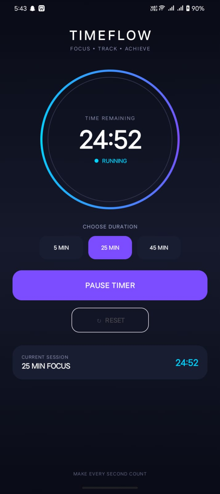

# Timer App ⏱️

A simple and user-friendly **Timer App** developed using Android Studio. The application allows users to set a countdown timer and control it using start, pause, and reset options.

## Features

* ⏱️ Set a countdown timer
* ▶️ Start the timer
* ⏸️ Pause the timer
* 🔄 Reset the timer
* 🔔 Timer completion notification
* 📱 Simple and user-friendly interface

## Technologies Used

* **Android Studio**
* **Kotlin**
* **XML**
* **Gradle**
* **Android SDK**

## How to Run

1. Clone this repository:

```bash
git clone https://github.com/Sawaira-Waheed/TimerApp.git
```

2. Open the project in **Android Studio**.

3. Allow Gradle to sync and download the required dependencies.

4. Connect an Android device or start an Android Emulator.

5. Click the **Run ▶** button to launch the application.

## How to Use

1. Enter or set the desired timer duration.
2. Press **Start** to begin the countdown.
3. Press **Pause** to temporarily stop the timer.
4. Press **Reset** to reset the timer.
5. When the timer reaches zero, the timer completion action will occur.

## Application Screenshot



## Project Structure

The Timer App project is organized into different files and folders to keep the application structured and easy to manage. The `app` folder contains the main application source code, resources, and Android configuration files. The `gradle` folder contains the Gradle-related files required for building the project. The `build.gradle.kts` files contain the project and application build configurations, while `settings.gradle.kts` manages the project settings and modules. The `README.md` file provides information about the project, its features, technologies, and usage instructions. The `screenshots` folder contains screenshots of the application.

```text
TimerApp/
├── app/
├── gradle/
├── screenshots/
│   └── timer_app.png
├── build.gradle.kts
├── settings.gradle.kts
├── .gitignore
└── README.md
```

## Future Improvements

* Multiple timer support
* Custom alarm sounds
* Dark mode
* Timer history
* Custom timer presets
* Improved notification controls

## Author

**Sawaira Waheed**

## License

This project was developed for educational purposes.
